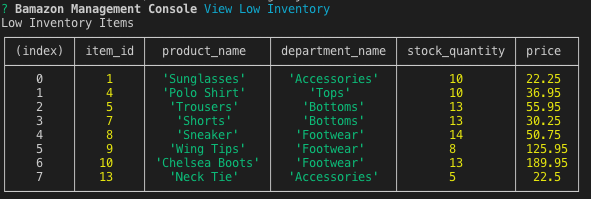

# bamazon | Node.js & MySQL

## Overview

bamazon is an AS-400/Amazon like storefront with the MySQL and Node JS utilizing Inquirer for Navigation and Execution. The app has two components `bamazonCustomer` and `bamazonManager` to serve both customers and managers specific needs

## MySQL Dependency

1. You will need to create a MySQL Database called `bamazon`.

2. Then create a Table inside of that database called `products`.

3. The products table should have each of the following columns:

   * item_id (unique id for each product)

   * product_name (Name of product)

   * department_name

   * price (cost to customer)

   * stock_quantity (how much of the product is available in stores)

4. Populate this database with around 10 different products. You will find the base seeds for the table in [MySql Table and Seeds](./bamazon.sql)

## BamazonCustomer

  * Can take in orders from customers and deplete stock from the store's inventory.

  Running this application will first display all of the items available for sale. Include the ids, names, and prices of products for sale.

1. The app on run will load the current stock and then uses `Enquirer` to prompt users with.

   * The product they would like to buy.

   * How many units of the product they would like to buy.

2. Once the customer has placed the order, the application will if your store has enough of the product to meet the customer's request.

   * If the quantity being purchased is greater than the stock the app will diplay `Insufficient quantity!`, and then prevent the order from going through.

   * If the store _does_ have enough of the product, it will fulfill the customer's order.
      * Updating the SQL database to reflect the remaining quantity.
      * Once the update goes through, show the customer the total cost of their purchase along with the quantity and item.

## BamazonManager

* Has set of menu options:

    * View Products for Sale
    
    * View Low Inventory
    
    * Add to Inventory
    
    * Add New Product

  * If a manager selects `View Products for Sale`, the app will list every available item: the item IDs, names, prices, and quantities.

  * If a manager selects `View Low Inventory`, then it will list all items with an inventory count lower than 15.

  * If a manager selects `Add to Inventory`, the app will display a prompt that will let the manager "add more" of any item currently in the store.

  * If a manager selects `Add New Product`, it will allow the manager to add a completely new product to the store.

